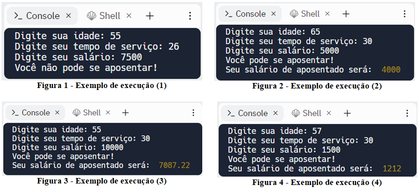

# Prática da Semana 2
  
Elabore um programa para que leia a idade, o tempo de serviço e o valor do último salário recebido de um trabalhador. Como resultado escreva se ele pode ou não se aposentar. E caso ele possa se aposentar calcule e mostre o valor de seu salário de aposentadoria.
As condições para aposentadoria são:

* Ter pelo menos 65 anos, ou;
* Ter trabalhado pelo menos 30 anos, ou;
* Ter pelo menos 60 anos e trabalhado pelo menos 25 anos;

Em caso de aposentadoria, o salário desse trabalhador seguirá as seguintes regras:

* Caso o tempo de serviço seja maior que 20 anos, seu salário de aposentadoria poderá ser de até 80% do último salário recebido como trabalhador;
* Caso o tempo de serviço seja menor ou igual a 20 anos, seu salário de aposentadoria poderá ser de até 60% do último salário recebido como trabalhador;
* O valor mínimo será de R$ 1212,00 e o valor máximo será de R$ 7087,22;

## Exemplos de execuções do programa
  

## Grade de correção

## Objetivos de aprendizagem
1. Utilizar comandos de decisão
2. Utilizar comandos de decisão aninhados  