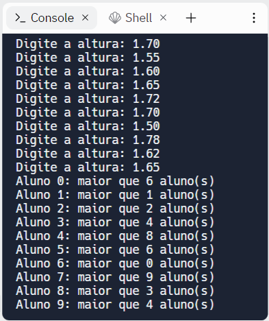

# Prática da Semana 4
  
Faça um algoritmo que receba dez alturas de alunos e, depois, exiba, para cada aluno, o número de alturas menores que a sua.

  ## Exemplo de execução do programa
  
  

  ## Grade de correção
  

  ## Objetivos de aprendizagem
  1. Utilizar comandos de repetição aninhados
  2. Utilizar coleções indexadas (array)
  

  